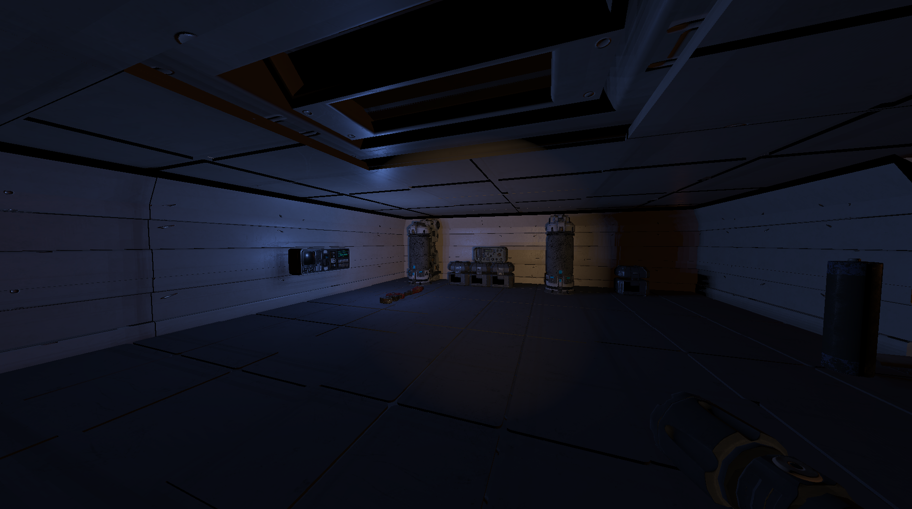
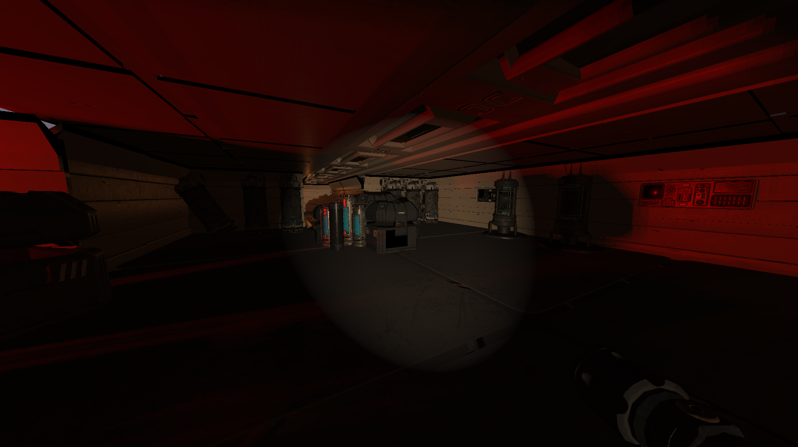
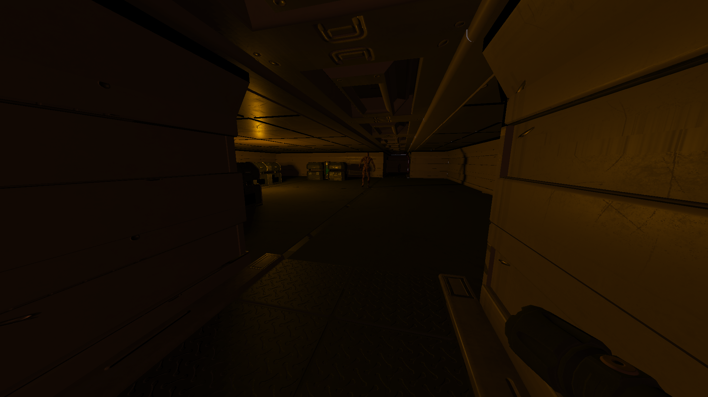
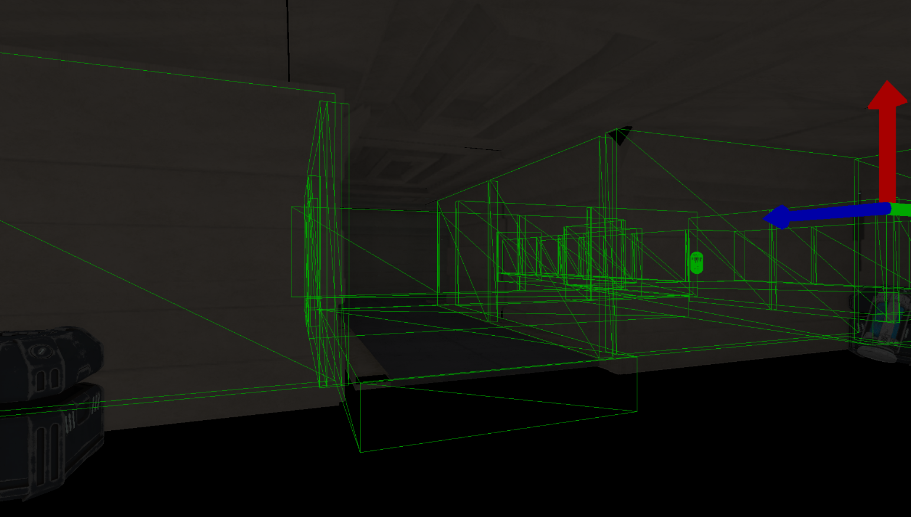
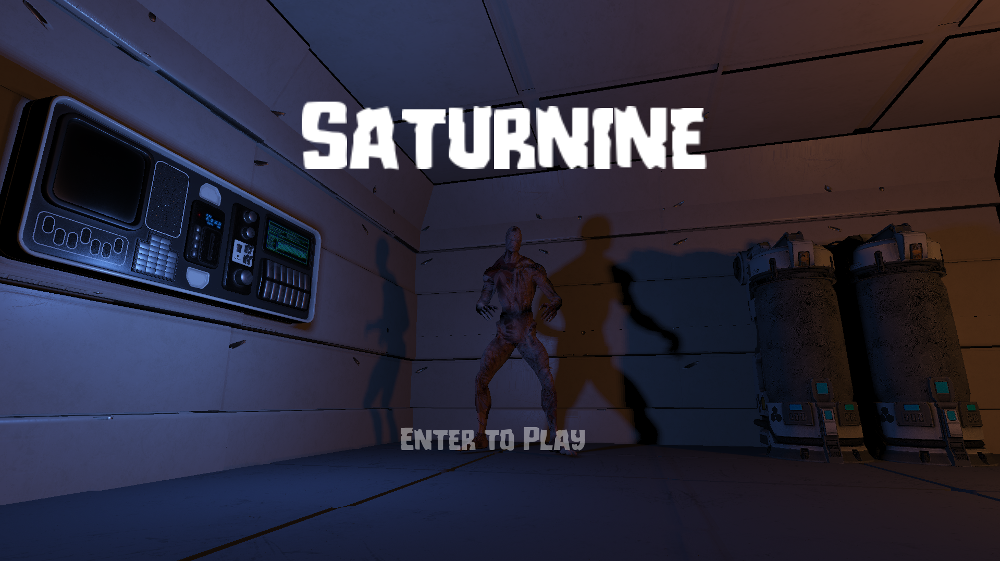

<html>
<link href="style.css" rel="stylesheet">

<h1 align="center"> Lich Engine Project</h1>

<h2> Introduction : </h2>
The Lich Engine is a game engine project coupled with an engine editor. This project has been made in four months. The engine is conceived to be used on Windows and uses OpenGL 4.5 as the graphics library. The main goal of this project was to create an engine for the creation of horror games. To fulfill this goal, we concentrate on the renderer feature to give a lot of tools to create an immersive environment. The group's members are :

<b>
<ul>
    <li> Matéo Erbisti
    <li> Lenny Rabinne
    <li> Antoine Mordant
    <li> Bryan Bachelet
</ul>
</b>
The project has been made in 4 months (March-June 2023)  
Portfolio Link: https://merbistigp.editorx.io/portfolio-mateo/blank-3-3-1-1-1-1-1  

<h2> Engine Features : </h2>

<h3><b> - Render :</b></h3> 
Our engine has a lot of render features in order to facilitate the creation of an amazing environment for the game created in the engine. The main feature is the Physically Based Rendering that allows our engine to have a realistic look. The second important render feature is Deferred Rendering, which allows us to have a lot of lights in our scenes. We have also other effects like Shadow Mapping, SSAO, or Normal Mapping.

<h3><b> - Physics :</b></h3>
Our engine has realistic physics available for the user. For this feature, we use the PhysX library from Nvidia which computes all of the physics calculations. Our engine can be linked to Nvidia Physics Debugger software in order to help users when they work on physics problems and need to debug.
 

 

 
    

        <h3><b> - Animation :</b></h3>
        Our engine can display classic animation by using skeleton and animation files. An object can have multiple animations and transition from one to another smoothly.
        

    

    

        <h3><b> - Scripting :</b></h3>
        The Lich engine allows users to create there's own script by using the reflection library of the engine. Scripts are in C++. There are also components allowing them to show variables in the editor's inspector.
        

    

<h3><b> - UI :</b></h3>
The Lich Engine has a basic UI display, we can show Text on screen and Image. All UI elements are limited to the screen to be positioned. For the text element, users can use multiple fonts and change their size. The image extension handles are .png and .jpg.

 

<h2> Tasks I've worked on : </h2>

• Render pipeline (Physically Based Rendering, Deferred Rendering, Shadow Mapping, Normal/Parallax Mapping, HDR, and every other graphics feature)  
• Animation System: Animator, Skeletons, and Animations. With our Animator component, you can choose which animation you want to play and its speed and you can make transitions between animations.  
• Resources loading including Models, Textures, Skeletons, Animations, Fonts...  
• UI System which can display texts with different fonts and images on the screen thanks to our Text and Image components  
• Material System which is useful to tweak some values such as the albedo, the roughness or metalness, or even if the object generates shadows or not. You can also edit the albedo, normal, height, metalness, roughness, and ambient occlusion maps. Depending on the model, you'll have different slots to put materials in our Mesh component.  

• Project Architecture
 <h2> Libraries Used : </h2>
For this project, we use multiple libraries to handle functionalities. Let's list them :
 <ul>
    <li> <b>OpenGL 4.5 </b> - This is the graphics API, we use in our engine
    <li> <b>GLFW </b> - For the software window
    <li> <b>PhysX</b> - That is the library that manages our engine physics. This library is from Nvidia
    <li> <b>FreeType</b> - This library is used to handle font files and show text on the screen
    <li> <b>RapidObj & Assimp </b> - These libraries manage the loading of game models in our engine
    <li> <b>STBImage</b> - Load images and textures
    <li> <b>Refureku</b> - Library that allows the reflection on our engine
    <li> <b>ImGui</b> - Editor UI interface library
</ul>

